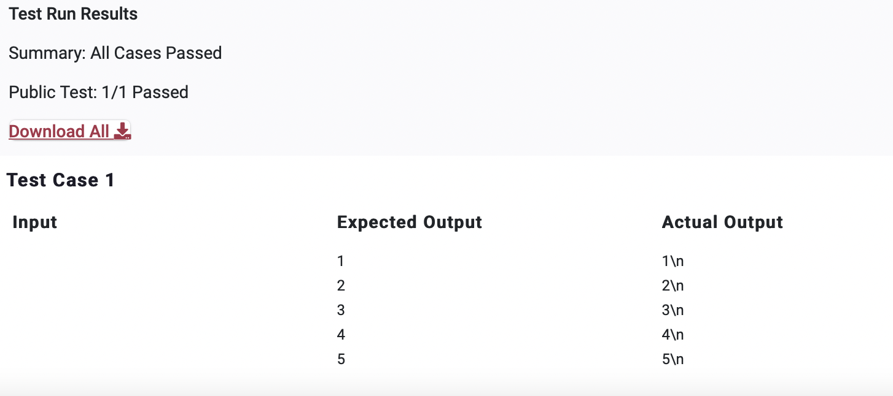

<!Comment>
# PPA1

>Question

    Print the first 5 positive integers in ascending order with one number in each line 

    Note: Do not worry about **\n** that comes at the end of the output.


>Python Code 

```python
print(1)
print(2)
print(3)
print(4)
print(5)
```
```python
for i in range(1,6):
    print(i)
```
---


---
---
Private Test Cases 1/1 Passed
---
