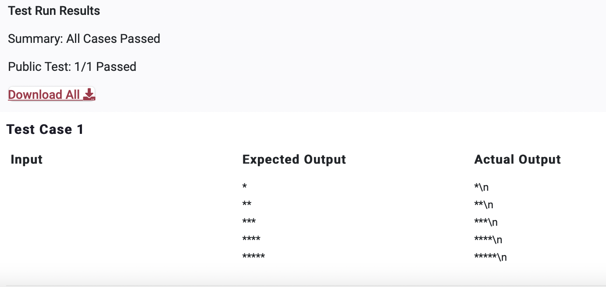

# PPA2

>Question

    Print the following pattern.

    *
    **
    ***
    ****
    *****

    There are no spaces between consecutive stars. There are no spaces at the end of each line.

    Note: Do not worry about the \n that you observe in the expected output. It can be ignored.

>Python Code

```python
print("*")
print("**")
print("***")
print("****")
print("*****")
```
---


---
---
Private Test Cases 1/1 Passed
---