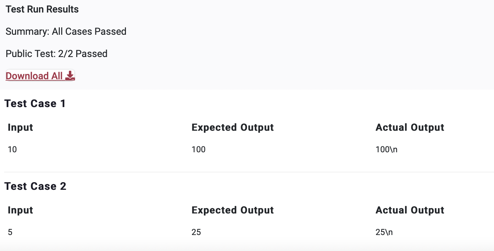

# PPA3

>Question

    Accept an integer as input and print its square as output. 

    Note: Do not worry about the \n that you observe in the expected output. It can be ignored.

>Python Code

```python
n = int(input())
print(n**2)
```
---


---
---
Private Test Cases 5/5 Passed
---