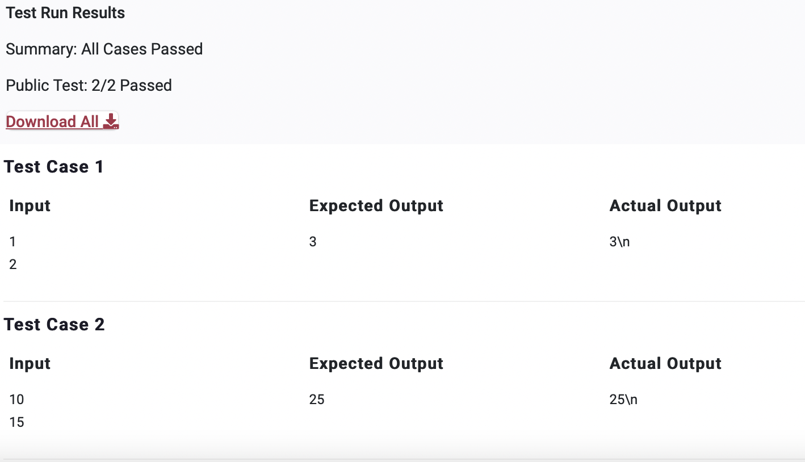

# PPA4

>Question

    Accept two integers as input and print their sum as output.

>Python Code

```python
a = int(input())
b = int(input())

print(a+b)

```

---


---
---
Private Test Cases 5/5 Passed
---