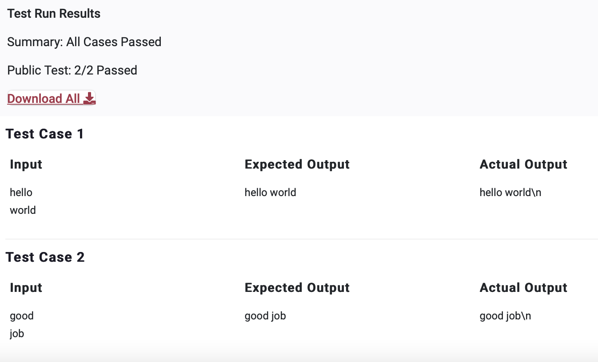

# PPA5

>Question

    Accept two words as input and print the two words after adding a space between them.

>Python Code
```Python
a = input()
b = input()

print(a,b)
```
Another way
```python
print('Lets try this once again')

a = input()
b = input()

print(a+' '+b)

```
---


---
---
Private Test Cases 5/5 Passed
---