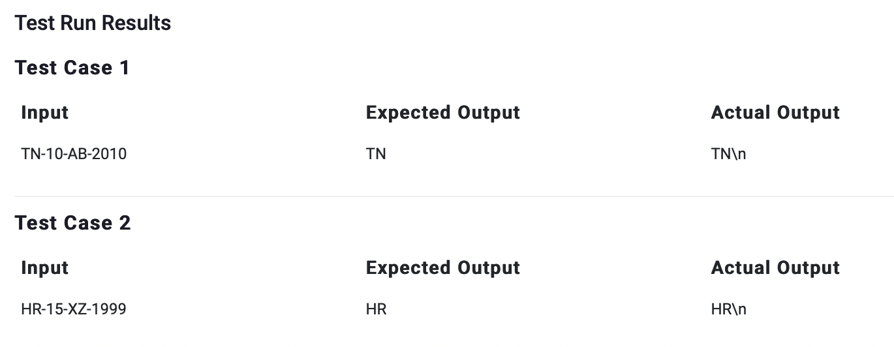

# PPA6

>Question

    Accept the registration number of a vehicle as input and print its state-code as output.

>Python Code
```python
n = input()
print(n[0:2])
```
```python
n=input()
print(n[0]+n[1])
```
---


---
---
Private Test Cases 5/5 Passed
---